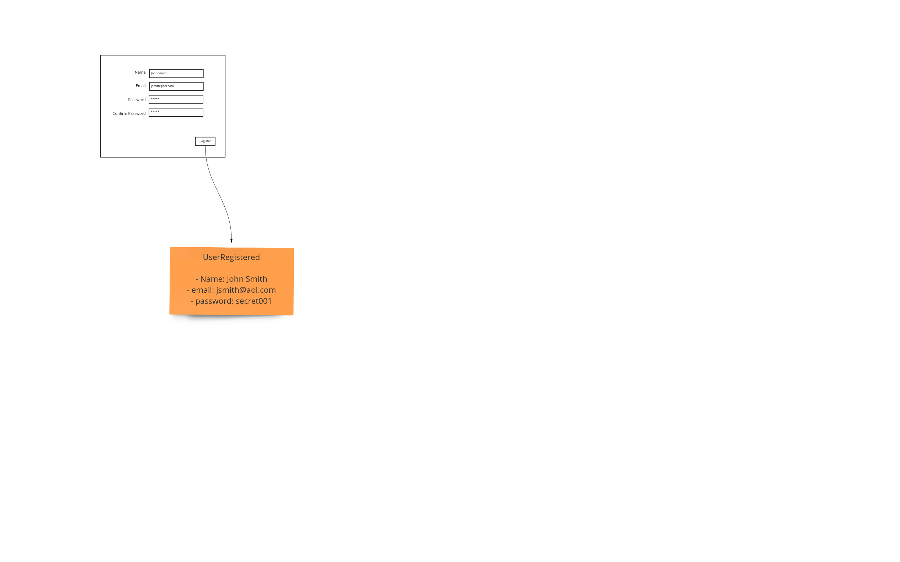
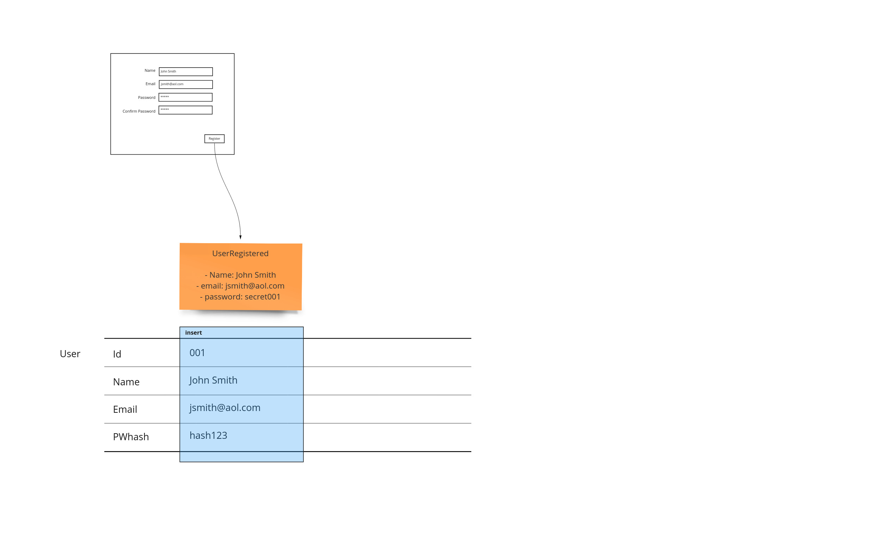
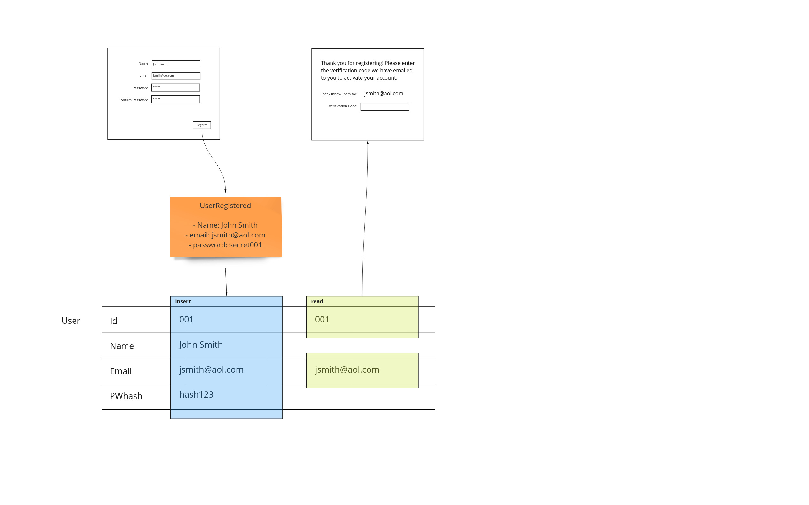
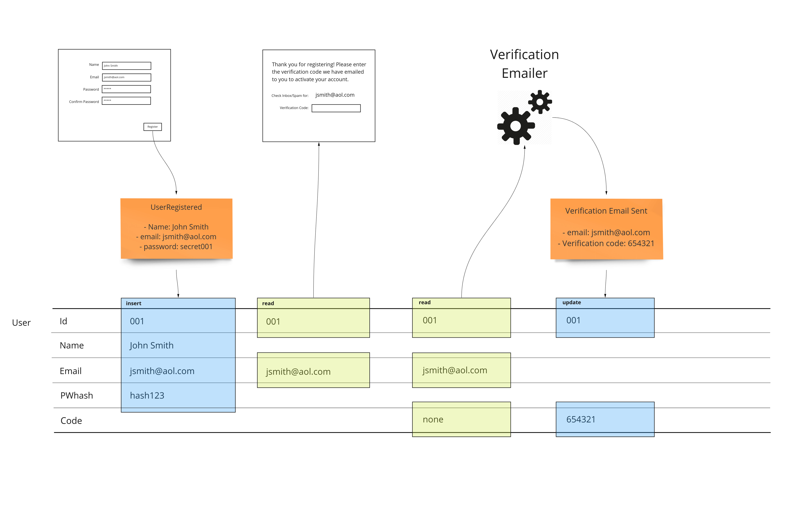
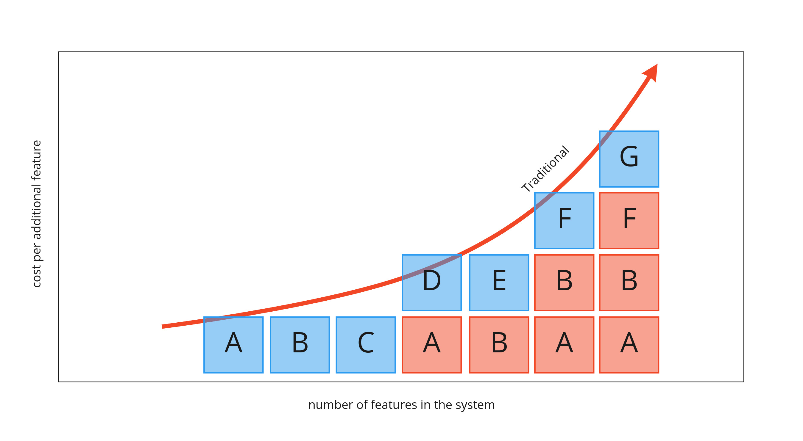
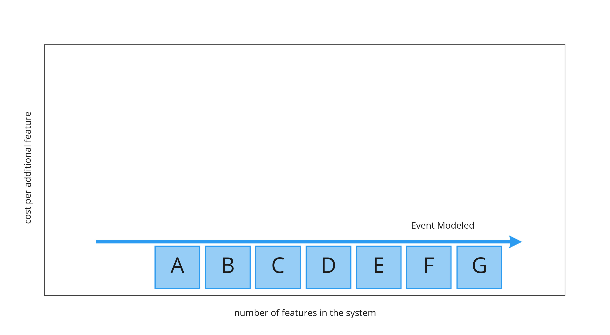

# Событийное моделирование традиционных систем

> "Покажите мне ваши блок-схемы и спрячьте ваши таблицы, и я буду продолжать оставаться в замешательстве. Покажите мне ваши таблицы, и мне не понадобятся ваши блок-схемы - они будут очевидны" - Фред Брукс, автор книги "Мифический человек-месяц".

Эта фундаментальная идея позволит нам использовать гораздо более простую методологию описания систем - практически любых информационных систем. Сосредоточившись на состоянии, а не на логике системы, мы можем сделать вывод о том, что она делает, вместо того чтобы отягощать себя мелочами, связанными с деталями автоматизации. В этом и заключается суть событийного моделирования: отбросить малозначимые аспекты проектирования систем, принятые в отрасли. Это позволяет распространить "спецификацию на примере" на область проектирования систем.

В этом посте мы рассмотрим преимущества использования состояния как с точки зрения пользователя, так и с точки зрения реального хранилища, поддерживающего систему. Разница в этих точках зрения покажет, как ассоциации различных частей системы друг с другом приводят к росту затрат по мере увеличения сложности, если мы не проектируем систему с учетом этих связей с самого начала.

Ключевым аспектом подхода является демонстрация изменения системы во времени. Для наглядного примера мы начнем слева и будем двигаться вправо, чтобы увидеть, как логично проектируется система, содержащая только те части информации, которые необходимы нам для выполнения приведенного в примере рабочего процесса.

## Пользовательский интерфейс

Начнем с проектирования экрана, который пользователь увидит вначале.

## События

События происходят - сохранять их или нет, это наш выбор. В данном случае мы этого не делаем - по крайней мере, напрямую. Мы показываем, что пользователь вводит в систему. Мы показываем, как эта информация записывается. В данном случае мы можем показать, что система требует хранения хэша, поскольку хранение паролей напрямую небезопасно (см. следующий раздел). Поскольку это показано на нашей событийной модели, мы можем при необходимости объяснить нетехническим специалистам, почему это важно и где это проявляется при взаимодействии с системой.

## Таблицы

До сих пор мы фиксировали то, что видел пользователь, а затем то, что он делал в итоге, в виде событий. Табличное представление представлено набором плавающих полос, которые соответствуют записям - или строкам. Это позволяет нам видеть, где данные обновляются, вставляются, удаляются и, что более важно, привязываются к различным этапам рабочего процесса. Поскольку такая форма представления занимает много места, она показана внизу, чтобы не вытеснять другие артефакты.

## Представления

При переходе на следующую страницу в нашем приложении мы можем показать некоторую информацию, введенную пользователем. Важно показать, откуда именно поступает эта информация. Это позволит нам показать, где на каждом этапе нашего рабочего процесса есть зависимости. Несмотря на то что идентификатор не отображается на странице, это важная информация, которая используется для получения интересующего нас электронного письма.

На этом базовый цикл ввода и обратной связи, составляющий Event Models, завершен. В следующей части этого поста мы добавим дополнительную функциональность, которая покажет, как можно использовать модели событий, чтобы не нести эти растущие расходы. Мы также рассмотрим те же паттерны для автоматизации и трансляции, но без парадигмы событийного моделирования, о которой шла речь в предыдущей части.

## Автоматизация

Мы показываем отправку электронной почты в виде сервиса, который работает за нас. Мы можем показать, в каком именно состоянии находится рабочий процесс отправки проверочного письма. Это уже может повлиять на некоторые виды работ, которые мы выполняли до того, как приступили к их реализации. Поскольку мы планируем, мы можем убедиться, что созданная нами схема будет выполнена правильно с первого раза. Для отслеживания состояния проверки электронной почты мы будем использовать столбец под названием "code".

## Повторная обработка

Эффективное использование хранилища требует переделки дизайна существующих таблиц по мере добавления новых функций в нашу систему. Именно эта переделка приводит к тому, что по мере роста размера всей системы функции становятся все дороже и дороже. На следующем графике показано, что функции от A до G становятся все дороже. Их удорожание связано с необходимостью корректировки предыдущей, уже реализованной функциональности.

Функция D требует переделки функции A. Функция E требует вскрытия и корректировки функции B. По мере роста решения ситуация ухудшается. Функциональность F зависит от переделки как функциональности A, так и B. Это может стать гораздо хуже, так как этот тип зависимости может начать складываться. Функция G зависит от корректировки функции F, что приводит к повторному рефакторингу функций A и B.

Пример этого мы видели в начале статьи, когда добавляли функцию верификации в наш пример с регистрацией. Когда нам понадобилось хранить проверочный код, пришлось добавить колонку в таблицу пользователей.

Ключевой момент заключается в следующем: Если бы мы реализовывали решение в процессе проектирования, то нам пришлось бы вернуться и добавить эту возможность в оператор вставки.

Если же мы подождем, пока не найдем место для всех данных в системе, и опишем их изменение в событийной модели, то практически полностью избавимся от переделок.

Возможность получить работу, которая будет стоить одинаково независимо от того, когда она будет запрограммирована, очень важна для устранения рисков в проектах благодаря надежному бюджету и графику.

## Малый аванс на проектирование

Козлом отпущения современных подходов, таких как agile, называют водопад, когда мы слишком много планируем, чтобы не приступить к работе достаточно быстро. В бюрократических крупных организациях это всегда представлялось как очень дорогостоящее вложение года.

"Никакого большого проектирования наперед", известное как BDUF, стало боевым кличем агилистов, которые стремятся покончить с бюрократией и довести дело до конца, полагаясь на жесткие контуры обратной связи, которые вместо этого позаботятся о проектировании посредством "эмерджентного проектирования".

Но что, если нам не нужен "большой" дизайн? Событийное моделирование - это идея о том, что, концентрируясь только на важных частях дизайна, мы эффективно делаем его маленьким. Поскольку он маленький, мы можем делать его быстро.

## Потеря данных

Что происходит, когда мы обновляем информацию? Она удаляется. Мы теряем часть истории, которая может быть очень важна для устранения неполадок в нашем решении. Событийная модель показывает, где происходят такие потери. Мы можем обсудить, следует ли учитывать историю некоторых более важных записей или стоит полностью перейти на хранение без потерь.

## Аудитория

Можно подумать, что это нечто более техническое по сравнению с событийной моделью систем с источниками событий. Возможно, это и так, но чего стоит понимание всеми сотрудниками организации того, где находится информация, с которой они имеют дело. Это не должно быть большим бременем для понимания. Поэтому мы должны стремиться к тому, чтобы не добавлять в событийную модель никакого кода или логики. Как и раньше, если мы будем следовать свидетельствам того, как информация меняется в системе с течением времени, мы будем говорить с гораздо большей аудиторией. Понимание системы - это ключ к тому, чтобы каждый имел представление о сложности и усилиях, необходимых для удовлетворения потребностей бизнеса.

## Устаревший код

Когда мы рассматриваем действительно хрупкие системы, которые были чрезмерно усложнены, у нас была стратегия заморозить кодовую базу и установить некоторые слушатели на состояние, чтобы обеспечить побочный подход к исправлению ошибок и расширению функциональности системы. Однако теперь мы можем использовать событийную модель для анализа системы с точки зрения состояния.

### Рефактор

Традиционно при попытке рефакторинга кодовой базы основное внимание уделялось структуре логики. Это, конечно, ограничивало аудиторию только разработчиками. Теперь можно показать масштаб изменений, убедившись, что те участки кода, которые мы хотим устранить, не повлияют на состояние в тех местах, где мы этого не ожидаем. Такой аудит позволяет нам определить масштаб того, на что повлияет наш рефакторинг. Это позволит нам полагаться на меньшее количество регрессионных тестов, чтобы убедиться, что мы не затронули другие области, которые работают или должны оставаться неизменными.

### Переработка

Если нам удалось получить достаточное количество данных о рабочих процессах из нашей событийной модели в традиционной системе, то мы будем иметь больше шансов на успех, когда будем переделывать систему с самого начала. Как и при событийном моделировании системы, основанной на событиях, наши усилия по переработке связанного рабочего процесса должны дать нам оценки, полученные на основе эмпирических данных, которые могут быть привязаны к другим конструкциям, представленным в этой модели, таким как количество шагов рабочего процесса, затрагиваемых при реализации определенных вертикальных срезов.

Хотя этот подход не так прост, как подход, основанный на событиях, мы все же можем получить более точные оценки, основанные на эмпирических данных. Устранение субъективности является ключевым моментом для получения более обоснованных оценок проекта.

## Заключение

Фред Брукс был прав, когда говорил о том, что можно рассматривать только таблицы. Его высказывание можно расширить по смыслу и применить к любой форме сохранения информации в системе. Даже если мы не храним события, они все равно являются наиболее эффективным способом описания того, что должна делать система, - особенно если это делается на примере.
